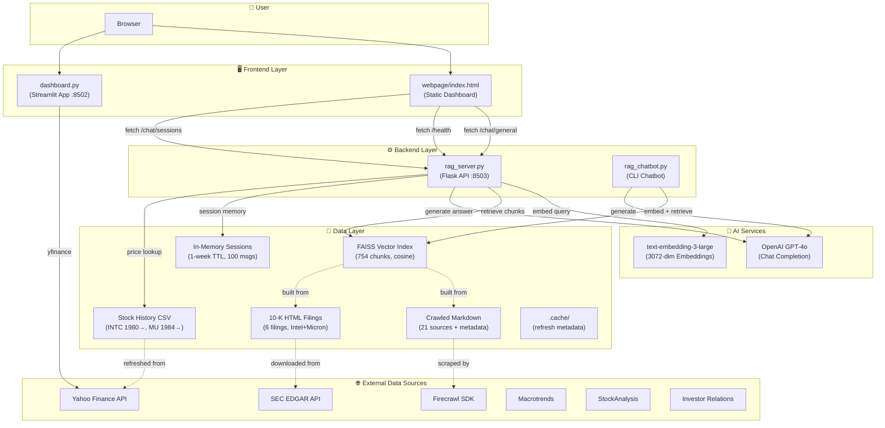
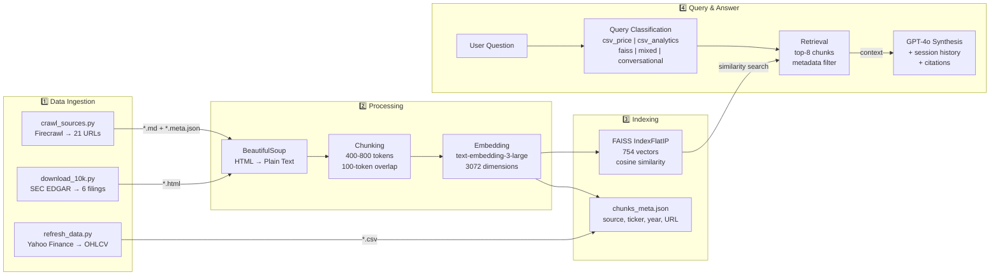
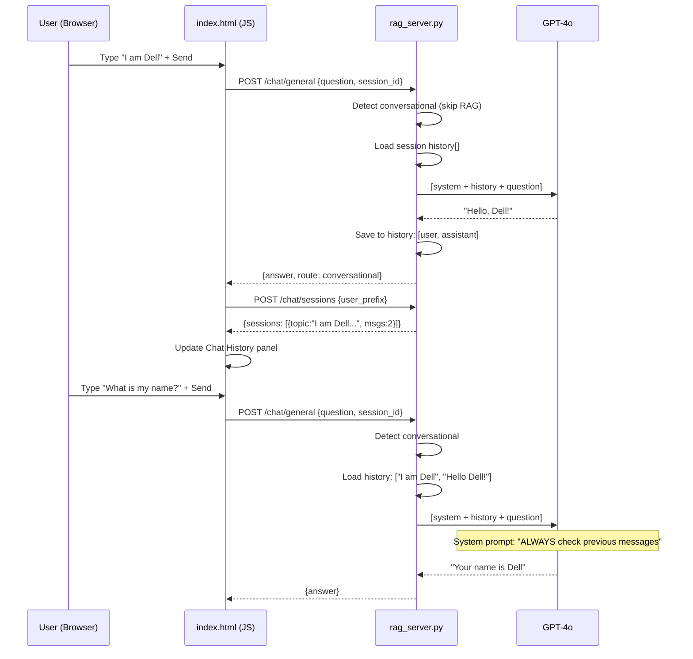
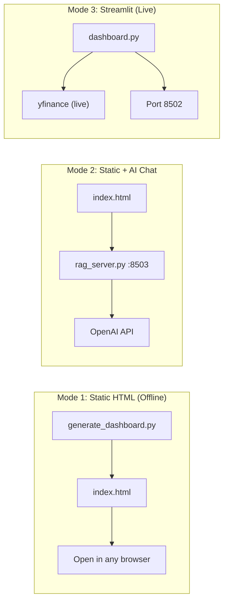

# InvestorGPT — System Architecture

**Last updated:** 2026-08-07

---

## High-Level Architecture



---

## Data Pipeline Flow



---

## AI Chat Memory Flow



---

## File Structure

```
InvestorGPT/
├── dashboard.py              # Streamlit live dashboard (port 8502)
├── scripts/
│   ├── rag_server.py         # Flask REST API (port 8503) — AI Chat backend
│   ├── rag_chatbot.py        # CLI RAG chatbot (interactive + single-query)
│   ├── build_index.py        # Chunk → Embed → FAISS index builder
│   ├── crawl_sources.py      # Firecrawl web scraper (21 URLs, 6 source types)
│   ├── download_10k.py       # SEC EDGAR 10-K downloader
│   ├── refresh_data.py       # Yahoo Finance OHLCV data refresh
│   └── generate_dashboard.py # Static HTML dashboard generator
├── webpage/
│   ├── index.html            # Generated static dashboard (all data embedded)
│   ├── loading.html          # Loading/redirect page
│   └── startup_status.js     # Startup progress tracker
├── data/
│   ├── stock_history/        # INTC + MU daily OHLCV CSVs (11k+ rows each)
│   ├── crawled/              # Markdown + metadata from web scraping
│   ├── 10k/                  # Intel & Micron 10-K HTML filings
│   └── rag_index/            # FAISS index + chunk metadata JSON
├── docs/                     # Project documentation
├── .cache/                   # Refresh metadata
├── .env                      # API keys (OPENAI_API_KEY, FIRECRAWL_API_KEY)
├── requirements.txt          # Python dependencies
├── open_dashboard.bat        # Full mode: refresh → generate → open browser
├── open_dashboard_fast.bat   # Fast mode: skip refresh, open existing HTML
├── start_investor.bat        # Launch Streamlit dashboard
├── stop_investor.bat         # Stop Streamlit
└── _keeper.bat               # Watchdog — auto-restart on crash
```

---

## Component Details

### Frontend Components

| Component | Technology | Port | Purpose |
|-----------|-----------|------|---------|
| Static Dashboard | HTML + Chart.js + Bootstrap | file:// | Self-contained analytics (no server needed for charts) |
| AI Chat | HTML + fetch() → Flask | 8503 | RAG-powered conversational AI |
| Streamlit Dashboard | Streamlit + Plotly | 8502 | Live interactive dashboard |

### Backend Endpoints

| Endpoint | Method | Description |
|----------|--------|-------------|
| `/health` | GET | Server status + API key check |
| `/chat/general` | POST | Main AI chat (routing + RAG + memory) |
| `/chat` | POST | RAG-only chat (no routing) |
| `/chat/clear` | POST | Clear session memory |
| `/chat/sessions` | POST | List user's session history |
| `/data-sources` | GET | FAISS + CSV source catalogue |
| `/analytics` | POST | Direct CSV analytics (no LLM) |

### Query Router

| Route | Trigger | Data Source | Example |
|-------|---------|-------------|---------|
| `csv_price` | Date + price keywords | Stock CSV | "Intel price on 2025-01-06" |
| `csv_analytics` | Returns, CAGR, volatility | Stock CSV | "INTC total return 2023-2024" |
| `faiss` | Strategy, risk, filings | FAISS index | "Intel AI strategy" |
| `mixed` | Price + context | CSV + FAISS | "Stock after HBM announcement" |
| `conversational` | Greetings, name, memory | Session only | "What is my name?" |

### Signal Engine (10 Factors)

| Factor | Weight | Range |
|--------|--------|-------|
| RSI (14-day) | 12% | 0-100 |
| Stochastic RSI | 7% | 0-100 |
| Bollinger Band %B | 10% | 0-100 |
| 2-Year Z-Score | 20% | 0-100 |
| 52-Week Position | 8% | 0-100 |
| MA200 Deviation | 12% | 0-100 |
| MA50/200 Convergence | 8% | 0-100 |
| MACD Histogram | 8% | 0-100 |
| Volatility Regime | 8% | 0-100 |
| 10-Day ROC | 7% | 0-100 |

**Score interpretation**: 0 = Strong Buy, 50 = Neutral, 100 = Strong Sell

---

## Deployment Modes



| Mode | Command | Needs Server | Needs Internet |
|------|---------|-------------|----------------|
| **Static (charts only)** | `open_dashboard_fast.bat` | No | No |
| **Static + AI Chat** | `open_dashboard.bat` | Yes (port 8503) | Yes (OpenAI) |
| **Streamlit Live** | `start_investor.bat` | No | Yes (yfinance) |

---

## Technology Stack

| Layer | Technology | Version |
|-------|-----------|---------|
| LLM | OpenAI GPT-4o | Latest |
| Embeddings | text-embedding-3-large | 3072-dim |
| Vector DB | FAISS (faiss-cpu) | 1.7.4+ |
| Tokenizer | tiktoken (cl100k_base) | 0.5+ |
| Web Scraping | Firecrawl SDK | Latest |
| HTML Parsing | BeautifulSoup + lxml | 4.x |
| Charts (Static) | Chart.js | 4.4.4 |
| Charts (Streamlit) | Plotly | 5.15+ |
| Dashboard | Streamlit | 1.35+ |
| API Server | Flask + flask-cors | 3.x |
| Forecasting | statsmodels ARIMA | 0.14+ |
| Data | pandas + numpy | 2.0+ |
| Stock Data | yfinance | 0.2.31+ |
| Python | CPython | 3.14 |
