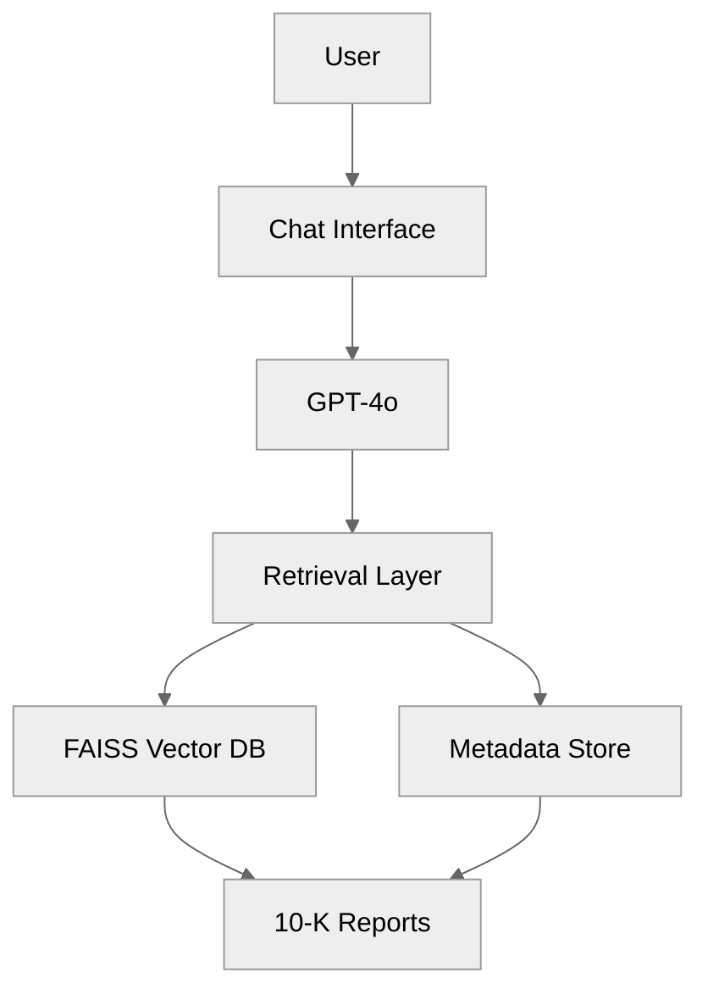

# SemiconInvest AI — Documentation Index

## Documents

### 1. Getting Started
| Document | Purpose |
|---|---|
| [HOW_TO_RUN.md](HOW_TO_RUN.md) | First-time setup, start/stop dashboard, RAG pipeline commands |

### 2. Architecture & Reference
| Document | Purpose |
|---|---|
| [CONTEXT_RESTORE.md](CONTEXT_RESTORE.md) | Canonical folder layout, startup architecture, port map |
| [SIGNAL_LOGIC.md](SIGNAL_LOGIC.md) | Buffett scorecard, 10-factor signal, decision matrix formulas |
| [tool-use.md](tool-use.md) | Tool registry — API, embeddings, vector store, RAG status |

### 3. Project History
| Document | Purpose |
|---|---|
| [progress.md](progress.md) | Phase completion status and roadmap |
| [CHANGELOG.md](CHANGELOG.md) | History of significant changes |

## Quick Start

```powershell
cd "c:\Users\bhoe\VS Code\InvestorGPT"
start_investor.bat
```

Open: `http://localhost:8502`

---

# SemiconInvest AI — Project Specification

## Project Name

| Type | Name |
|---|---|
| Recommended | SemiconInvest AI: Semiconductor Investor Research Assistant |
| Alternative | InvestorGPT: AI-Powered Investment Research Assistant |

---

## Project Objective

Build a GenAI-powered investment research chatbot that helps users analyze semiconductor companies using official SEC annual reports (10-K filings).

The chatbot will use **Retrieval-Augmented Generation (RAG)** to retrieve information directly from company 10-K reports and provide citation-backed answers.

---

## Initial Scope

| Company | Ticker |
|---|---|
| Intel Corporation | INTC |
| Micron Technology | MU |

---

## Data Source

The project will use only official Form 10-K filings from the SEC.

| Company | FY2023 | FY2024 | FY2025 |
|---|---|---|---|
| Intel | Form 10-K | Form 10-K | Form 10-K |
| Micron | Form 10-K | Form 10-K | Form 10-K |

> **Total knowledge base:** 6 annual reports (~1,000-1,500 pages)
>
> Both Intel and Micron are publicly traded U.S. companies filing annual Form 10-K reports with the SEC, containing business information, risk factors, management discussions, and audited financial statements. [intc.com] [sec.gov]

---

## Scope & Features

| Feature | Priority |
|---|---|
| Chat with Micron annual reports | Must Have |
| Chat with Intel annual reports | Must Have |
| Answer questions with citations | Must Have |
| Compare revenue, profit, and key metrics | Must Have |
| Multi-company benchmarking dashboard | Nice to Have |
| Real-time stock price integration | Future Enhancement |

---

## Core Capabilities

### 1. Chat with Annual Reports

Users can ask natural language questions such as:

- What is Intel's AI strategy?
- What drove Micron's revenue growth?
- What are Intel's manufacturing challenges?
- What does Micron say about HBM memory demand?

The chatbot retrieves relevant report sections and generates grounded answers.

### 2. Financial Metrics Retrieval

Retrieve information directly from financial statements, including:

| Metric | Metric |
|---|---|
| Revenue | EPS |
| Gross Margin | Cash Flow |
| Operating Income | Total Assets |
| Net Income | R&D Expense |

**Example:**

> **Question:** What is Micron's FY2025 revenue?
>
> **Response:** Micron reported revenue of XX billion USD.
> **Source:** Micron FY2025 Form 10-K, Consolidated Statements of Operations, Page XX.

### 3. Company Comparison

Users can compare Intel and Micron across financial and operational metrics.

**Example questions:**
- Compare Micron and Intel gross margin.
- Which company spent more on R&D?
- Compare FY2025 revenue growth.
- Which company generated more operating cash flow?

### 4. Citation-Based Responses

Every answer should include:

| Element | Description |
|---|---|
| Source document | Company and filing year |
| Section reference | Section name (e.g., Risk Factors) |
| Page number | Exact page from the filing |
| Supporting evidence | Quoted excerpt |

**Example:**

> Intel identified manufacturing execution risks, competitive pressure, and geopolitical uncertainty as key business risks.
>
> **Source:** Intel FY2025 Form 10-K - Risk Factors Section, Page XX

This approach increases transparency and reduces hallucinations.

---

## Example Questions the Chatbot Should Answer

### Financial Performance
- What is Micron's FY2025 revenue?
- What was Intel's FY2025 net income?
- Compare Micron and Intel gross margins.
- Which company spent more on R&D in FY2025?
- Compare operating cash flow between Intel and Micron.

### Business Strategy
- What is Intel's AI strategy?
- What are Micron's growth drivers?
- What are Intel's manufacturing priorities?
- How does Micron position itself in the HBM market?

### Risk Analysis
- What were the major business risks identified by Intel?
- What risks does Micron identify?
- Compare risk factors disclosed by Intel and Micron.
- What geopolitical risks are highlighted by both companies?

### Evidence-Based Queries
- Show evidence and source page.
- Which section mentions this topic?
- Where did the company discuss this risk?
- Quote the relevant excerpt from the filing.

---

## Out of Scope (MVP)

The following questions cannot be reliably answered using only 10-K reports:

| Question | Reason |
|---|---|
| What is Intel's stock price today? | Requires real-time market data |
| What is Micron's current P/E ratio? | Requires real-time market data |
| What do analysts expect next quarter? | Requires analyst databases |
| What is the current target price? | Requires external data providers |
| Which stock should I buy today? | Outside scope of this tool |

---

## Success Criteria

The chatbot is considered successful if it can accurately answer:

- "What is Micron's FY2025 revenue?"
- "Compare Micron and Intel gross margin."
- "What were the major business risks identified by Intel?"
- "Show evidence and source page."

### Quality Requirements

| Requirement | Description |
|---|---|
| Grounded answers | Responses based on source documents only |
| Accurate financials | Correct metrics from filings |
| Page-level citations | Every answer cites exact page |
| Company comparison | Side-by-side comparison capability |
| Traceable evidence | Supporting quotes included |
| Minimal hallucination | No fabricated data |

---

## High-Level Architecture



---

## Suggested Technology Stack

| Layer | Technology | Notes |
|---|---|---|
| Frontend | Streamlit | Recommended for MVP |
| Frontend (alt) | React | Optional |
| Backend | Python + FastAPI | Core API layer |
| LLM | Azure OpenAI GPT-4o | Primary language model |
| Embeddings | text-embedding-3-large | Document vectorization |
| Vector Database | FAISS | Recommended |
| Vector Database (alt) | ChromaDB | Alternative |

---

## Final MVP Statement

**SemiconInvest AI** is a focused GenAI + RAG solution that uses only Intel and Micron 10-K annual reports to provide investor-grade research capabilities, including document chat, financial metric retrieval, company comparison, and citation-backed answers. By limiting the scope to six 10-K filings, the project remains low-cost, achievable, and highly demonstrable while delivering meaningful investment research insights.
